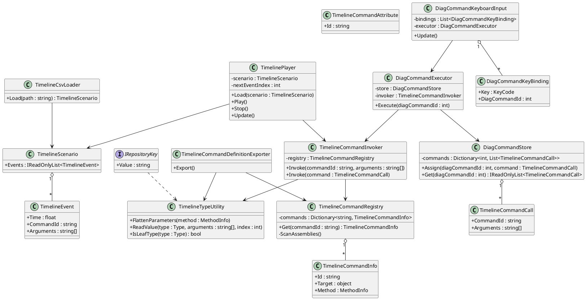
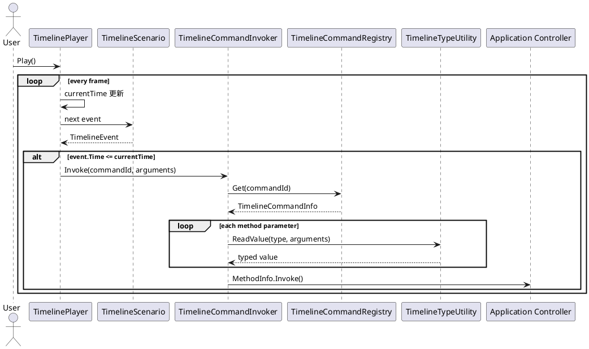
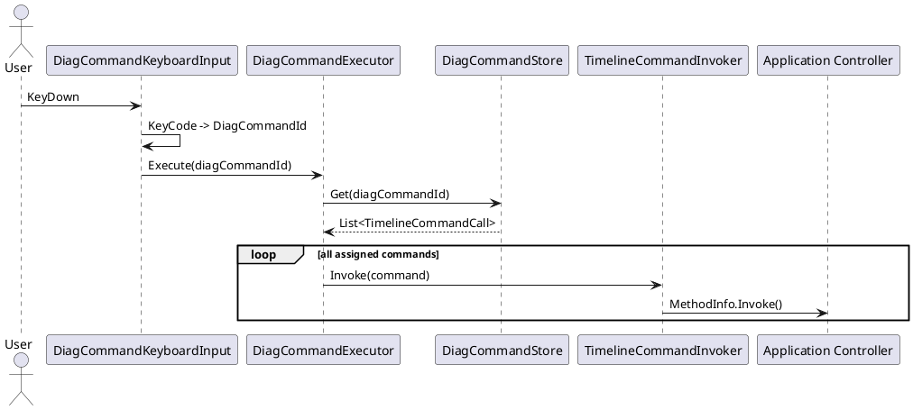
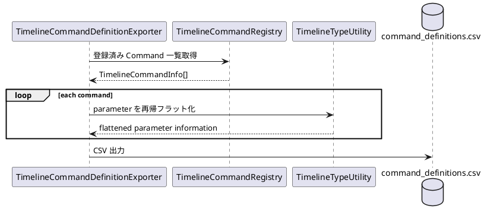

# Timeline System V2 設計書

## 1. 目的

本システムは、専用エディタで作成した Timeline CSV を Unity で読み込み、時刻順にコマンドを実行するための汎用 Timeline 実行基盤である。

設計上の主な目的は以下とする。

- Timeline CSV から任意のコマンドを時刻順に実行できること
- `[TimelineCommand]` 属性が付与されたメソッドを自動的にコマンドとして利用できること
- コマンド引数として任意のクラスを利用できること
- クラス内部の任意深さのネストに対応できること
- `enum`、`[Flags] enum`、Repository 用 ID 型を扱えること
- Unity 側のコマンド定義から専用エディタ用 `command_definitions.csv` を自動生成できること
- DiagCommandId に複数コマンドを割り当て、キーボード入力からまとめて実行できること
- 機能追加時に Timeline 基盤側の変更を最小化すること
- 過度なクラス分割を避け、保守性と可読性を両立すること

---

## 2. 設計方針

### 2.1 基本方針

Timeline 基盤は以下の責務に限定する。

1. Timeline CSV の読み込み
2. コマンドの自動探索と登録
3. CSV 上の文字列引数から C# 型への復元
4. コマンドメソッドの呼び出し
5. Timeline の時間進行
6. DiagCommand の登録・実行
7. 専用エディタ用コマンド定義 CSV の生成

Sound、Light、UI、Image 等の具体的な機能は Timeline 基盤に含めない。

Timeline 基盤は `[TimelineCommand]` が付与されたメソッドを呼び出すだけとする。

### 2.2 JSON は使用しない

複合型の引数は JSON として 1 セルに保存せず、末端メンバーまでフラット化して `Arg1`, `Arg2`, ... に展開する。

例:

```csharp
public class PlaySoundRequest
{
    public SoundId SoundId { get; }
    public SoundOutputSettings Output { get; }

    public PlaySoundRequest(
        SoundId soundId,
        SoundOutputSettings output)
    {
        SoundId = soundId;
        Output = output;
    }
}

public class SoundOutputSettings
{
    public float Volume { get; }
    public SoundArea Area { get; }

    public SoundOutputSettings(
        float volume,
        SoundArea area)
    {
        Volume = volume;
        Area = area;
    }
}
```

Timeline CSV:

```csv
Time,Command,Arg1,Arg2,Arg3
0.0,PlaySound,Warning01,0.8,Front|Rear
```

対応関係:

```text
Arg1 -> request.SoundId
Arg2 -> request.Output.Volume
Arg3 -> request.Output.Area
```

---

## 3. システム全体構成

```plantuml
@startuml
skinparam packageStyle rectangle
skinparam classAttributeIconSize 0

package "Dedicated Editor" {
    [command_definitions.csv] as CommandDefinitionCsv
    [repository csv] as RepositoryCsv
    [Timeline Editor] as TimelineEditor
    [timeline.csv] as TimelineCsv

    CommandDefinitionCsv --> TimelineEditor
    RepositoryCsv --> TimelineEditor
    TimelineEditor --> TimelineCsv
}

package "Unity Runtime" {
    class TimelineCommandRegistry
    class TimelineTypeUtility
    class TimelineCsvLoader
    class TimelinePlayer
    class TimelineCommandInvoker
    class DiagCommandStore
    class DiagCommandExecutor
    class DiagCommandKeyboardInput

    TimelineCsv --> TimelineCsvLoader
    TimelineCsvLoader --> TimelinePlayer
    TimelinePlayer --> TimelineCommandInvoker
    TimelineCommandInvoker --> TimelineCommandRegistry
    TimelineCommandInvoker --> TimelineTypeUtility

    DiagCommandKeyboardInput --> DiagCommandExecutor
    DiagCommandExecutor --> DiagCommandStore
    DiagCommandExecutor --> TimelineCommandInvoker
}

package "Unity Editor" {
    class TimelineCommandDefinitionExporter

    TimelineCommandDefinitionExporter --> TimelineCommandRegistry
    TimelineCommandDefinitionExporter --> TimelineTypeUtility
    TimelineCommandDefinitionExporter --> CommandDefinitionCsv
}

package "Application" {
    class SoundController
    class LightingController
    class DisplayController
    class ImageController
}

TimelineCommandRegistry ..> SoundController : discover
TimelineCommandRegistry ..> LightingController : discover
TimelineCommandRegistry ..> DisplayController : discover
TimelineCommandRegistry ..> ImageController : discover
@enduml
```

---

## 4. 主要クラス一覧

| クラス | 役割 |
|---|---|
| `TimelineCommandAttribute` | Timeline から呼び出せるメソッドを指定する |
| `TimelineOptionSourceAttribute` | 専用エディタで選択肢を取得する Repository 等を指定する |
| `IRepositoryKey` | Repository 検索用 ID クラスの共通契約 |
| `TimelineCommandInfo` | 1 つの Timeline Command の MethodInfo と対象インスタンスを保持する |
| `TimelineCommandRegistry` | Assembly 全体を走査し、Timeline Command を自動登録・検索する |
| `TimelineTypeUtility` | 型解析、引数フラット化、値変換、クラス再構築を担当する |
| `TimelineEvent` | 実行時刻、Command ID、生引数を保持する |
| `TimelineScenario` | 読み込まれた TimelineEvent の一覧を保持する |
| `TimelineCsvLoader` | Timeline CSV を読み込み TimelineScenario を生成する |
| `TimelineCommandCall` | Command ID と生引数を保持し、DiagCommand の割り当てにも利用する |
| `TimelineCommandInvoker` | TimelineCommandCall を型付き引数へ変換し、対象メソッドを呼び出す |
| `TimelinePlayer` | 再生時刻を管理し、到達した TimelineEvent を順次実行する |
| `DiagCommandStore` | DiagCommandId と複数の TimelineCommandCall の対応を保持する |
| `DiagCommandExecutor` | 指定 DiagCommandId に登録された全コマンドを順番に実行する |
| `DiagCommandKeyBinding` | KeyCode と DiagCommandId の対応を保持する |
| `DiagCommandKeyboardInput` | キー入力を監視し、対応する DiagCommand を実行する |
| `TimelineCommandDefinitionExporter` | C# のコマンド定義から `command_definitions.csv` を生成する |

---

## 5. クラス関係



---

## 6. Timeline Command の定義

### 6.1 基本

Timeline から呼び出したいメソッドには `[TimelineCommand]` を付与する。

```csharp
[TimelineCommand("PlaySound")]
public void PlaySound(
    PlaySoundRequest request)
{
    ...
}
```

Command ID は CSV との契約になるため、メソッド名とは分離して明示する。

### 6.2 Command ID の一意性

同じ Command ID が複数検出された場合は起動時エラーとする。

Assembly の探索順によってどちらかを採用する挙動は禁止する。

### 6.3 対象メソッド

原則として以下を満たすメソッドのみを許可する。

- `public`
- generic method ではない
- `ref` / `out` parameter を持たない
- Command ID が空ではない
- VContainer から DeclaringType のインスタンスを取得可能

---

## 7. Timeline Command の自動探索

`TimelineCommandRegistry` はアプリ起動時に以下を実行する。

```text
AppDomain.CurrentDomain.GetAssemblies()
    ↓
Assembly.GetTypes()
    ↓
Type.GetMethods()
    ↓
[TimelineCommand] を持つ Method を抽出
    ↓
VContainer から対象インスタンスを Resolve
    ↓
TimelineCommandInfo を生成
    ↓
Dictionary へ登録
```

探索は起動時に 1 回のみ行う。

再生中に Assembly や Attribute を再検索しない。

---

## 8. 引数型の扱い

### 8.1 末端型

以下を末端型として扱う。

- `string`
- `bool`
- `int`
- `float`
- `double`
- `enum`
- `[Flags] enum`
- `IRepositoryKey`

末端型以外の class は複合型として再帰解析する。

### 8.2 構造体

V2 では独自構造体を使用しない。

Timeline 引数として利用する独自データ型は class とする。

### 8.3 Repository Key

Repository で利用する ID クラスは `IRepositoryKey` を実装する。

```csharp
public interface IRepositoryKey
{
    string Value { get; }
}
```

例:

```csharp
public sealed class SoundId : IRepositoryKey
{
    public string Value { get; }

    public SoundId(string value)
    {
        Value = value;
    }
}
```

`TimelineTypeUtility` は具体型を知らず、`IRepositoryKey` を実装しているかだけで判定する。

---

## 9. 複合クラスのフラット化

例:

```csharp
public class NotificationRequest
{
    public TargetInfo Target { get; }
    public LightScenarioId Light { get; }
    public NotificationArea Area { get; }

    public NotificationRequest(
        TargetInfo target,
        LightScenarioId light,
        NotificationArea area)
    {
        Target = target;
        Light = light;
        Area = area;
    }
}

public class TargetInfo
{
    public TargetType Type { get; }
    public float Distance { get; }

    public TargetInfo(
        TargetType type,
        float distance)
    {
        Type = type;
        Distance = distance;
    }
}
```

フラット化:

```text
request.Target.Type
request.Target.Distance
request.Light
request.Area
```

CSV:

```csv
Time,Command,Arg1,Arg2,Arg3,Arg4
2.0,NotifyObstacle,Pedestrian,12.5,WarningLight,Left|Front
```

任意深さまで同じルールで再帰する。

### 9.1 循環参照

以下のような循環型はサポートしない。

```text
A -> B -> A
```

型解析時に循環を検出した場合はエラーとする。

---

## 10. クラスの再構築

`TimelineTypeUtility` は CSV のフラットな引数列からクラスを再構築する。

優先する生成方法は以下。

1. 引数付きコンストラクタ
2. parameterless constructor + writable property

Timeline 用引数クラスでは、原則として引数付きコンストラクタを推奨する。

理由:

- CSV の Arg 順と C# のコンストラクタ引数順を対応させやすい
- 必須値を明確にできる
- immutable に近い設計にできる
- Reflection の property 列挙順に依存しなくてよい

---

## 11. Enum

### 11.1 通常 Enum

CSV:

```text
Left
```

専用エディタ:

```text
[ Left ▼ ]
```

Runtime:

```csharp
Enum.Parse(enumType, rawValue, true);
```

### 11.2 Flags Enum

例:

```csharp
[Flags]
public enum DisplayArea
{
    None = 0,
    Left = 1 << 0,
    Center = 1 << 1,
    Right = 1 << 2
}
```

CSV:

```text
Left|Right
```

専用エディタ:

```text
☑ Left
☐ Center
☑ Right
```

Runtime では `|` を `,` に変換して `Enum.Parse` する。

---

## 12. Timeline CSV

基本形式:

```csv
Time,Command,Arg1,Arg2,Arg3,...
```

例:

```csv
Time,Command,Arg1,Arg2,Arg3
0.0,PlaySound,Warning01,0.8,Front|Rear
1.5,PlayLight,PedestrianAlert,false,
3.0,SetUiVisibility,MainWarning,true,
```

### 12.1 ルール

- `Time` は秒
- `Command` は `[TimelineCommand]` の Command ID
- 引数は C# メソッドシグネチャのフラット化順
- 同一時刻の場合は CSV 上の行順を維持する

---

## 13. Timeline 再生処理



### 13.1 フレームスキップ

例えば再生時刻が、

```text
90 ms
↓
130 ms
```

へ飛んだ場合でも、

```text
100 ms
110 ms
120 ms
```

のイベントを while ループですべて実行する。

時刻の完全一致では判定しない。

---

## 14. DiagCommand

### 14.1 目的

DiagCommandId に 1 個以上の Timeline Command を割り当て、後から ID を指定してまとめて実行する。

例:

```csv
Time,Command,Arg1,Arg2,Arg3,Arg4
0.0,SetDiagCommand,101,PlaySound,Warning02,1.0
0.0,SetDiagCommand,101,PlayLight,PedestrianAlert,false
```

ID `101` には以下が登録される。

```text
101
├─ PlaySound(...)
└─ PlayLight(...)
```

### 14.2 `DiagCommandStore`

内部イメージ:

```text
Dictionary<int, List<TimelineCommandCall>>
```

同じ DiagCommandId に対する複数登録を許可する。

登録順を保持する。

### 14.3 実行

`DiagCommandExecutor.Execute(101)` を呼ぶと、

```text
PlaySound
↓
PlayLight
```

の順で全コマンドを `TimelineCommandInvoker` 経由で実行する。

DiagCommand 用に別のコマンド実行機構は作らない。

---

## 15. キーボードからの DiagCommand 実行



Inspector 例:

```text
Bindings
├─ Alpha1 -> 101
├─ Alpha2 -> 102
└─ Alpha3 -> 103
```

---

## 16. Command 定義 CSV の自動生成

Unity Editor から C# の `[TimelineCommand]` 定義を解析し、専用エディタ向け `command_definitions.csv` を生成する。

メニュー:

```text
Tools
└─ Timeline V2
   └─ Export Command Definitions CSV
```

### 16.1 生成フロー



### 16.2 出力例

```csv
Command,ArgIndex,ArgName,MemberPath,Type,Required,Source,Options,MultiSelect
PlaySound,1,request,SoundId,RepositoryKey,true,SoundRepository,,false
PlaySound,2,request,Output.Volume,Float,true,,,false
PlaySound,3,request,Output.Area,Enum,true,,Front|Rear,true
```

### 16.3 Command 候補

Command 列に出現してよいのは `[TimelineCommand]` が付与されたメソッドの Command ID のみとする。

引数クラス、enum 型、Repository Key 型などは Command 候補に含めない。

---

## 17. 専用エディタ

専用エディタは `command_definitions.csv` の情報のみを利用して入力 UI を生成する。

C# の Reflection ロジックを専用エディタ側に重複実装しない。

| Type | UI |
|---|---|
| `String` | TextBox |
| `Int` / `Float` / `Double` | Number input |
| `Bool` | Checkbox |
| `Enum` | Dropdown |
| `Enum + MultiSelect` | Checkbox list |
| `RepositoryKey` | Repository CSV を元に Dropdown |
| `Command` | Command Dropdown + 選択した Command の引数 UI |

---

## 18. VContainer

主要クラスは Singleton として登録する。

例:

```csharp
builder.Register<TimelineCommandRegistry>(Lifetime.Singleton);
builder.Register<TimelineCsvLoader>(Lifetime.Singleton);
builder.Register<TimelineCommandInvoker>(Lifetime.Singleton);
builder.Register<TimelinePlayer>(Lifetime.Singleton);

builder.Register<DiagCommandStore>(Lifetime.Singleton);
builder.Register<DiagCommandExecutor>(Lifetime.Singleton);

builder.RegisterComponentInHierarchy<DiagCommandKeyboardInput>();
```

`[TimelineCommand]` 対象の Controller も VContainer から Resolve 可能な状態にしておく。

---

## 19. エラー処理方針

可能な限り再生開始前またはアプリ起動時に検出する。

### Registry 初期化時

- Command ID 重複
- VContainer で対象を Resolve できない
- unsupported method signature
- generic method
- `ref` / `out`
- 空 Command ID

### Command 定義 CSV 出力時

- 循環クラス
- 生成不能なクラス
- unsupported leaf type
- RepositoryKey の不正定義

### Timeline CSV 読み込み時

- Time の形式不正
- Command ID 不明
- 引数数不足
- 数値変換失敗
- enum 値不正
- RepositoryKey 生成失敗

---

## 20. 拡張方法

### 新しい Command

```csharp
[TimelineCommand("ShowWarning")]
public void ShowWarning(WarningRequest request)
{
    ...
}
```

その後 `command_definitions.csv` を再生成する。

### 新しい Enum

通常 enum はそのまま利用可能。

複数選択の場合は `[Flags]` を付与する。

### 新しい Repository ID

`IRepositoryKey` を実装する class を追加する。

```csharp
public sealed class VideoId : IRepositoryKey
{
    public string Value { get; }

    public VideoId(string value)
    {
        Value = value;
    }
}
```

Timeline 基盤側の変更は不要。

### 新しい複合引数

class を追加し、Command 引数として利用する。

任意深さのネストに対応するため Timeline 基盤側の変更は不要。

---

## 21. V2 の責務境界

```text
TimelineCommandRegistry
    Command を探す・保持する

TimelineTypeUtility
    型を解析し、CSV値から C# オブジェクトを組み立てる

TimelineCsvLoader
    CSV を読む

TimelineCommandInvoker
    Command を呼ぶ

TimelinePlayer
    時間を管理する

DiagCommandStore
    DiagCommand の割り当てを保持する

DiagCommandExecutor
    DiagCommand をまとめて実行する

DiagCommandKeyboardInput
    キーボード入力を DiagCommand 実行へ変換する

TimelineCommandDefinitionExporter
    専用エディタ用定義 CSV を作る
```

---

## 22. 設計上の原則

- Command の追加によって Timeline 基盤を修正しない
- 具体的な `SoundId`、`UiState` 等を Timeline 基盤にハードコードしない
- 型の個別名称ではなく、`enum`、`IRepositoryKey`、class 等の性質で処理する
- Timeline API と Application 内部実装を分離する
- Reflection は起動時・定義生成時を中心に使用し、毎フレーム探索しない
- CSV の形式は人間が確認しやすい単純な形式を維持する
- 専用エディタと Runtime で同じ型定義を二重管理しない
- V2 の独自データ型には構造体を使用しない
- 必要以上の Pattern・Interface・Wrapper を追加しない
